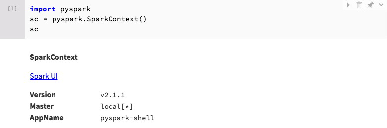

# Disp

Providing default representations of common objects in Python land



Works in IPython when the object is the value returned by the last statement of
a cell, or when calling `display()` on it. 

## Install 

```
$ pip install disp
$ ipython -c 'import disp; disp.install()'
💖 Installation succeeded: enjoy disp ! 💖
```

## Uninstall

```
$ ipython -c 'import disp; disp.uninstall()'
```

## Supported objects

the following object will gain superpowers:

 - `pyspark.context:SparkContext`
 - `pyspark.sql:SparkSession`

## Do you support more objects ? 

Do you want to submit a Pull Request ? 
